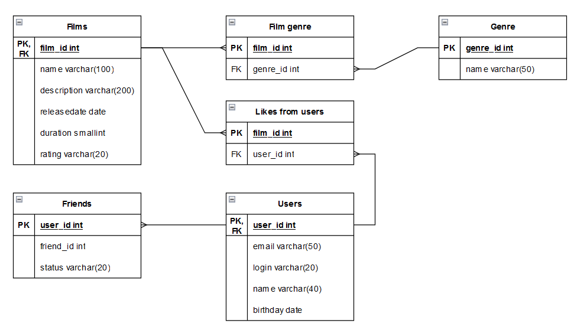

# java-filmorate

**Получение всех фильмов:**

SELECT *

FROM films

**Получение всех пользователей:**

SELECT *

FROM users

**Получение топ 50 фильмов:**

SELECT name

FROM films

WHERE film_id IN (SELECT film_id, COUNT(user_id)

FROM likes_from_users

GROUP BY film_id

ORDER BY COUNT(user_id) DESC

LIMIT 50)

**Получение списка общих друзей пользователя 1 с пользователем 2:**

SELECT u.friend_id

FROM (SELECT friend_id

FROM friends

WHERE user_id = 1) AS u

INNER JOIN friends AS f ON f.friend_id = u.friend_id

WHERE user_id = 2
