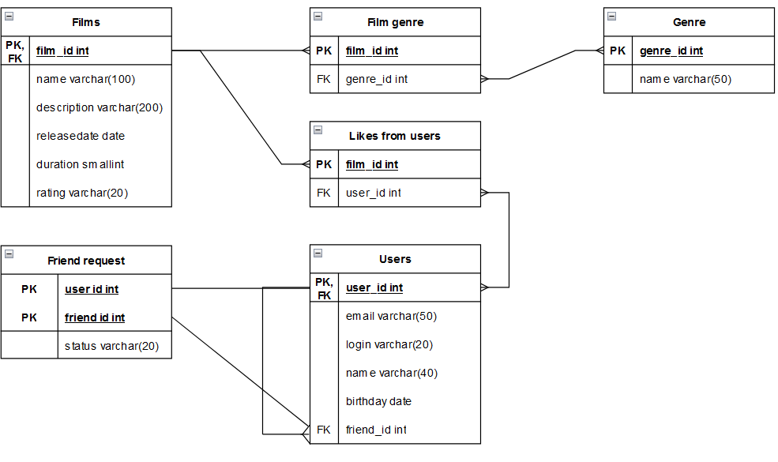

# java-filmorate

**Получение всех фильмов:**

SELECT DISTINCT name, description, releasedate, duration, genre, rating

FROM films

**Получение всех пользователей:**

SELECT DISTINCT name, login, email, birthday

FROM users

**Получение топ 50 фильмов:**

SELECT name, COUNT(likes from users)

FROM films

GROUP BY name

ORDER BY COUNT(likes from users) DESC

LIMIT 50

**Получение списка общих друзей с пользователем 1:**

SELECT friend_id

FROM users

WHERE user_id = 1
